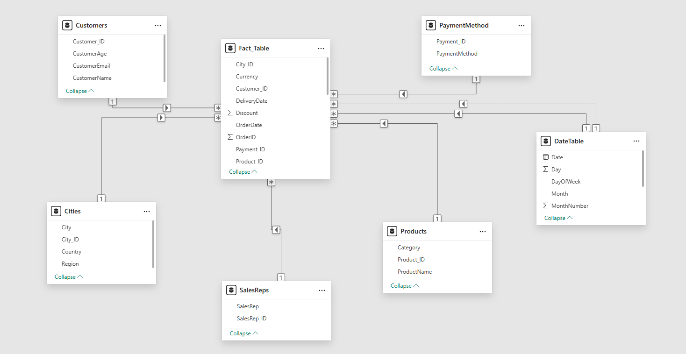
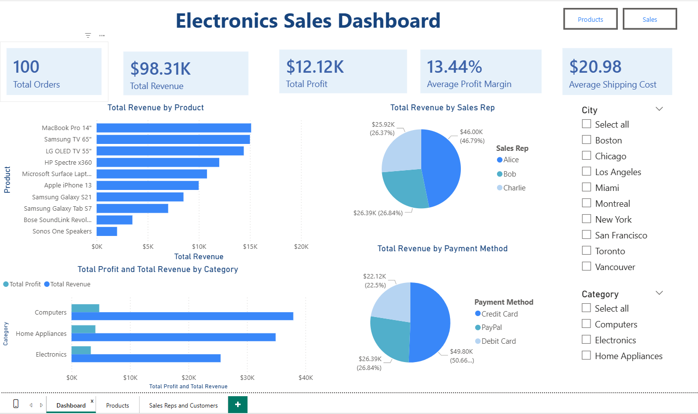
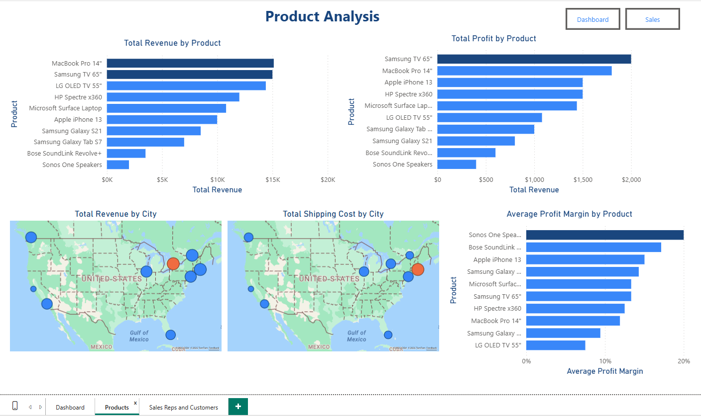
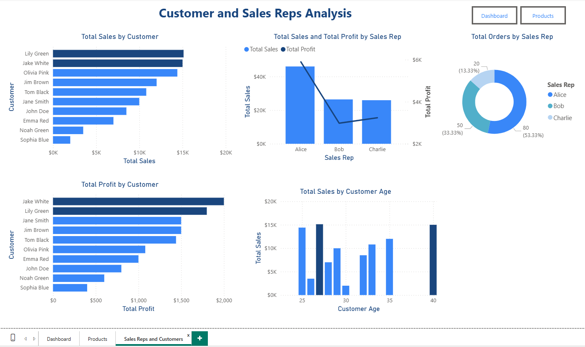

# Electronics Sales Dashboard — Power BI Project

A Power BI analytics project built on a dataset of 100 electronics retail transactions across 10 products, 9 cities, and 3 sales representatives in North America. The project covers the full BI workflow: data cleaning, currency normalization, dimensional modelling, DAX measures, and interactive dashboard design.

**Reporting period:** January 15 – January 30, 2026  
**Base currency:** USD (CAD converted at 0.74)  
**Tools:** Power BI Desktop, Power Query, DAX

---

## Table of Contents

- [Dataset Overview](#dataset-overview)
- [Data Cleaning](#data-cleaning)
- [Currency Normalization](#currency-normalization)
- [Data Model](#data-model)
- [DAX Measures](#dax-measures)
- [Dashboard Pages](#dashboard-pages)
- [Key Findings](#key-findings)
- [Recommendations](#recommendations)
- [Limitations](#limitations)

---

## Dataset Overview

The source file (`electronics_sales_data.xlsx`) contains 100 rows and 19 columns:

| Column | Type | Description |
|--------|------|-------------|
| `OrderID` | Integer | Unique transaction identifier |
| `CustomerName` | Text | Customer full name |
| `City` | Text | City of purchase |
| `Country` | Text | USA or Canada |
| `Region` | Text | North America |
| `ProductName` | Text | Product sold |
| `Category` | Text | Computers, Electronics, or Home Appliances |
| `SalesAmount` | Integer | Transaction revenue (local currency) |
| `Quantity` | Integer | Units sold |
| `Discount` | Integer | Discount percentage applied |
| `OrderDate` | Date | Date of order |
| `DeliveryDate` | Date | Date of delivery |
| `PaymentMethod` | Text | Credit Card, PayPal, or Debit Card |
| `SalesRep` | Text | Assigned sales representative |
| `ShippingCost` | Integer | Shipping cost (local currency) |
| `Profit` | Integer | Transaction profit (local currency) |
| `Currency` | Text | USD or CAD |
| `CustomerAge` | Integer | Customer age |
| `CustomerEmail` | Text | Customer email address |

---

## Data Cleaning

All transformations were performed in Power Query before loading to the Power BI model.

**Steps taken:**

1. Filtered each column individually to inspect for spelling errors, duplicate groupings, missing values, and data type mismatches.
2. Confirmed `OrderID` as the unique identifier (100 distinct values, no duplicates).
3. Verified data types across all columns: dates formatted as `Date`, numeric fields as `Whole Number` or `Decimal`.
4. Checked for pseudonyms, invalid entries (e.g., "N/A", "Anonymous"), and blank cells. No issues found.
5. Validated category groupings: 10 products across 3 categories, 9 cities across 2 countries, 3 sales reps, 3 payment methods.

The dataset was found to be generally clean with no significant corrections required.

---

## Currency Normalization

The dataset contains two currencies: **USD** (70 transactions) and **CAD** (30 transactions). To allow consistent aggregation, all CAD values were converted to USD.

**Exchange rate used:** `1 CAD = 0.74 USD`  
**Source:** Market rate at time of analysis

Three new columns were created in Power Query using conditional logic:

```
SalesAmount_USD =
    if [Currency] = "USD" then [SalesAmount]
    else [SalesAmount] * 0.74
```

```
Profit_USD =
    if [Currency] = "USD" then [Profit]
    else [Profit] * 0.74
```

```
ShippingCost_USD =
    if [Currency] = "USD" then [ShippingCost]
    else [ShippingCost] * 0.74
```

A `ProfitMargin` column was also added:

```
ProfitMargin = (Profit_USD / SalesAmount_USD) * 100
```

---

## Data Model

The cleaned dataset was restructured into a **star schema** with one fact table and six dimension tables.



**Dimension tables** were created by duplicating the original table in Power Query, removing unnecessary columns, adding an index column as the primary key, and then merging back to the fact table using a left outer join to replace descriptive columns with foreign key IDs.

**Relationships:**

| From (Fact Table) | To (Dimension) | Cardinality | Status |
|---|---|---|---|
| `City_ID` | `Cities.City_ID` | Many-to-one | Active |
| `Customer_ID` | `Customers.Customer_ID` | Many-to-one | Active |
| `Product_ID` | `Products.Product_ID` | Many-to-one | Active |
| `SalesRep_ID` | `SalesReps.SalesRep_ID` | Many-to-one | Active |
| `Payment_ID` | `PaymentMethod.Payment_ID` | Many-to-one | Active |
| `OrderDate` | `DateTable.Date` | Many-to-one | Active |
| `DeliveryDate` | `DateTable.Date` | Many-to-one | Inactive |

The `DeliveryDate` relationship is inactive by default and can be activated in DAX using `USERELATIONSHIP()`.

---

## DAX Measures

### Date Table

```dax
DateTable =
ADDCOLUMNS(
    CALENDAR(MIN(Fact_Table[OrderDate]), MAX(Fact_Table[OrderDate])),
    "Year", YEAR([Date]),
    "Quarter", "Q" & QUARTER([Date]),
    "Month", FORMAT([Date], "MMMM"),
    "MonthNumber", MONTH([Date]),
    "Week", WEEKNUM([Date]),
    "Day", DAY([Date]),
    "DayOfWeek", FORMAT([Date], "dddd")
)
```

### Calculated Measures

| Measure | Formula |
|---------|---------|
| Total Revenue | `SUM(Fact_Table[SaleAmount_USD])` |
| Total Profit | `SUM(Fact_Table[Profit_USD])` |
| Total Orders | `COUNT(Fact_Table[OrderID])` |
| Average Profit Margin | `AVERAGE(Fact_Table[ProfitMargin])` |
| Average Shipping Cost | `AVERAGE(Fact_Table[ShippingCost_USD])` |
| Total Shipping Cost | `SUM(Fact_Table[ShippingCost_USD])` |

---

## Dashboard Pages

### Page 1 - Executive Dashboard



The overview page displays five KPI cards across the top: **Total Orders (100)**, **Total Revenue ($98.31K)**, **Total Profit ($12.12K)**, **Average Profit Margin (13.44%)**, and **Average Shipping Cost ($20.98)**. Below the KPIs, a horizontal bar chart ranks products by sales amount, a grouped bar chart compares revenue and profit by category, a donut chart shows sales distribution by sales rep, and a pie chart breaks down revenue by payment method. City and Category slicers on the right side enable interactive filtering across all visuals.

### Page 2 - Product Analysis



Side-by-side bar charts compare total revenue and total profit by product, making it straightforward to spot where revenue and profitability diverge. Two map visuals plot total revenue and total shipping cost by city across the US and Canada. A horizontal bar chart shows average profit margin by product, sorted from highest (Sonos One Speakers at 20%) to lowest (LG OLED TV at 7.5%).

### Page 3 - Sales Reps and Customers



This page focuses on individual performance. A bar chart ranks customers by total sales, a combo chart pairs sales volume (bars) with profit (line) for each sales rep, and a donut chart shows order distribution across the team. Below, a profit-by-customer bar chart and a column chart of total sales by customer age complete the view.

## Key Findings

### 1. Revenue and profitability are inversely correlated at the product level

| Product | Revenue | Profit Margin |
|---------|---------|---------------|
| MacBook Pro 14" | $15,120 | 11.9% |
| Samsung TV 65" | $15,000 | 13.3% |
| Sonos One Speakers | $2,000 | 20.0% |
| Bose SoundLink Revolve+ | $3,500 | 17.1% |

The three highest-revenue products all fall below the company average margin of 13.44%. The two lowest-revenue products have the highest margins. The business seems to be volume dependent for profitability.

### 2. The LG OLED TV 55" is the least efficient product

At **7.5% profit margin**, it sits nearly half the company average. It generates $14,800 in revenue but contributes only $1,100 in profit, less than products generating half its revenue.

### 3. Home Appliances are the strongest category

| Category | Revenue | Avg Margin |
|----------|---------|------------|
| Computers | $38,000 | 12.6% |
| Home Appliances | $35,000 | 14.5% |
| Electronics | $25,000 | 12.9% |

Home Appliances deliver the best combination of revenue volume and profit margin.

### 4. Sales rep workload is heavily skewed

Alice handles **50 of 100 orders** (50%) and generates 46.8% of revenue. Bob achieves the highest margin (14.2%) despite handling only 30 orders. Charlie is the most efficient per transaction, matching Bobs revenue with only 20 orders.

### 5. New York has high frequency but low order value

New York accounts for 20 orders (double any other city) but averages $600 per order versus the company average of $983. This points to an opportunity to increase average order value through bundling or upselling.

### 6. The Canadian market is a meaningful contributor

With 30% of total orders and Toronto ranking as a top revenue city, Canada has great potential and is not a secondary market. All three Canadian cities (Toronto, Montreal, Vancouver) perform competitively against their US counterparts.

---

## Recommendations

**Product strategy**
- Promote high-margin products (Sonos, Bose, iPhone 13) e.g. through bundles.
- Review the LG OLED TVs cost structure or pricing. At 7.5% margin, it needs attention.
- Expand the Home Appliances category. Best margin to revenue ratio of any segment.

**Sales team strategy**
- Redistribute Alices workload to reduce concentration risk and free capacity for higher-value deals.
- Increase Charlie order assignments. Strongest per transaction performance on the team.

**Market strategy**
- Target upselling in New York. High order frequency with low ticket size is a clear bundling opportunity.
- Invest in Canadian market expansion, particularly Toronto and Montreal.
- Investigate San Franciscos underperformance ($2,000 total revenue, lowest of any city).

**Operations**
- Monitor shipping costs by city. The analysis (map visuals) show some markets carry disproportionate logistics costs.
- Maintain credit card payment infrastructure as the priority channel (50.7% of revenue). Continue supporting PayPal (26.8%).

---

## Limitations

- **Short time window.** The dataset covers only 16 days (January 15 to 30, 2026). Seasonal patterns, monthly trends, and year-over-year comparisons are not possible with this data.
- **Static exchange rate.** A fixed rate of 0.74 CAD/USD was applied across all transactions. A production system would use the rate at the time of each transaction.
- **Uniform order distribution.** Every product has exactly 10 orders.
